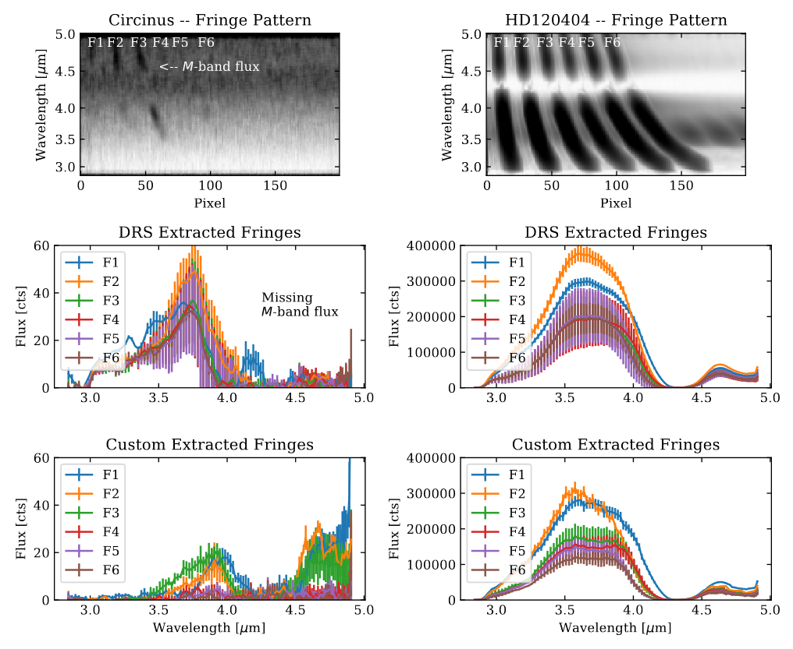

# matisse_lm_datareduction
Python scripts to process MATISSE LM-band for faint sources.

# Usage
1. First run the standard ESO Data Reduction Software (DRS) pipeline (https://www.eso.org/sci/software/pipelines/) on your target and calibrator
2. Make a config file (see the example in ./scripts) for each observing block (OB)
3. Run the `lm_cflux_cphase_extraction.py` script for each config file.
4. Calibrate the fluxes of your data using the `lm_custompipe_calibration.py` script

From there you have flux calibrated data for each exposure. You can do further Beam Commuting Device (BCD) calibration or averaging of exposures on a single baseline in the standard way for MATISSE. 

The Figure below (from Isbell+2023) shows the results of using this pipeline for the Circinus Galaxy and for a bright calibration star. More details can be found in Isbell (2022, PhD Thesis).

